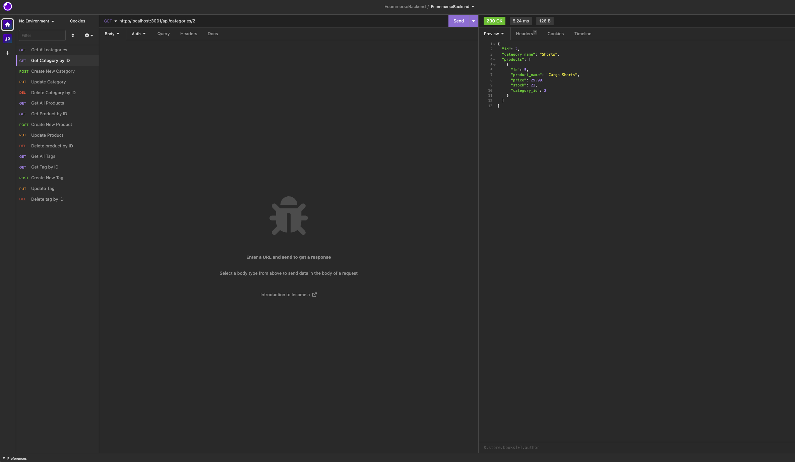
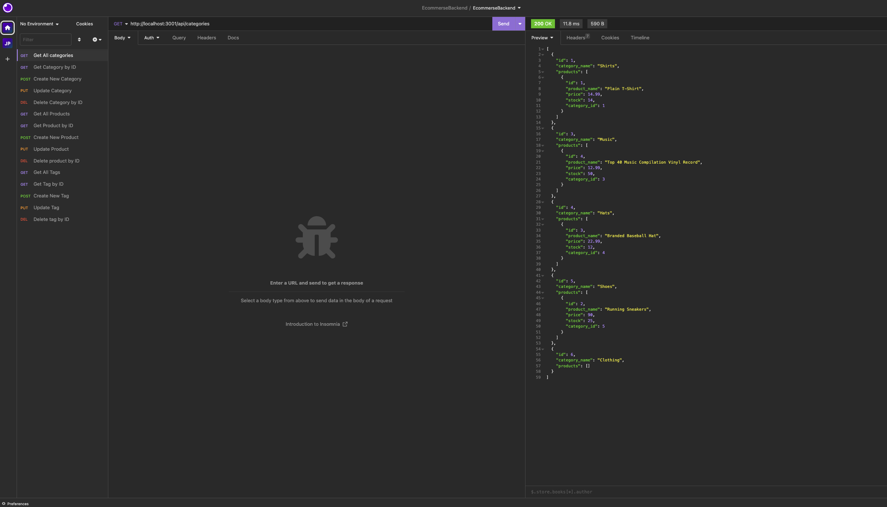

# Ecommerce Backend REST API

## Description

This application Is an Ecommerse Backend REST API.

## Libraries

- dotenv
- expressJS
- mysql2
- sequelize

## User Story

As a manager at an internet retail company, I wanr a back end for my e-commerce website that uses the latest technologies, so that my company can compete with other e-commerce companies

## Acceptance Criteria

GIVEN a functional Express.js API:

- WHEN I add my database name, MySQL username, and MySQL password to an environment variable file, then I am able to connect to a database using Sequelize

- WHEN I enter schema and seed commands, then a development database is created and is seeded with test data

- WHEN I enter the command to invoke the application, then my server is started and the Sequelize models are synced to the MySQL database

- WHEN I open API GET routes in Insomnia Core for categories, products, or tags, then the data for each of these routes is displayed in a formatted JSON

- WHEN I test API POST, PUT, and DELETE routes in Insomnia Core, then I am able to successfully create, update, and delete data in my database

## Mock-Up

The following animation demonstrates the application functionality:

- SQL connection: 0:00
- SEED Database: 0:23
- Start Server: 0:30
- GET: Categories, 0:38; Products, 1:05; Tags, 1:37
- GET by ID, POST, and DEL follow each of the above timestamps

## Installation

- Clone The Repository
- Create the Database As Seen In The Video Dem
- npm run seed
- npm start

## License

View "LICENSE" in Repository
